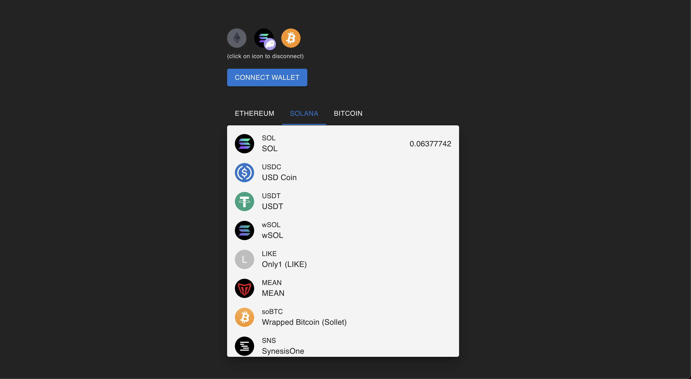

# Multichain wallet
> Wallet solution powered by LI.FI and Reown
> Live demo link [_here_](https:// .vercel.app/).

## Table of Contents
* [General Info](#general-information)
* [Technologies Used](#technologies-used)
* [Features](#features)
* [Screenshots](#screenshots)
* [Setup](#setup)
* [Areas for Improvement](#areas-for-improvement)


## General Information
- This project showcasing key features of LI.FI SDK


## Technologies Used
- React.js
- LI.FI SDK
- Reown AppKit
- TanStackQuery
- Wagmi


## Features
List the ready features here:
- Shows list of existing tokens in Ethereum, Solana and Bitcoin exosystem
- Read token balances
- Mobile friendly!


## Screenshots



## Setup
Make sure that you've Node > 20
`pnpm install`

## Areas for Improvement

Future Development Focus:
- The primary emphasis should be on enhancing the wallet connection experience. Appkit might be changed to a custom implemntation, resulting in reduction of bandle size and providing better accounts control.
- UI toolkit implemenation. MUI is good enough for PoC, but should be changed for a custom solution with a11y support.
- Implement wallet interaction within send/swap/bridge features.
- The TokenList component is bottleneck of application performance. Might be optimised with lazy loading for inifinity scroll

# React + TypeScript + Vite

This template provides a minimal setup to get React working in Vite with HMR and some ESLint rules.

Currently, two official plugins are available:

- [@vitejs/plugin-react](https://github.com/vitejs/vite-plugin-react/blob/main/packages/plugin-react/README.md) uses [Babel](https://babeljs.io/) for Fast Refresh
- [@vitejs/plugin-react-swc](https://github.com/vitejs/vite-plugin-react-swc) uses [SWC](https://swc.rs/) for Fast Refresh

## Expanding the ESLint configuration

If you are developing a production application, we recommend updating the configuration to enable type aware lint rules:

- Configure the top-level `parserOptions` property like this:

```js
export default tseslint.config({
  languageOptions: {
    // other options...
    parserOptions: {
      project: ['./tsconfig.node.json', './tsconfig.app.json'],
      tsconfigRootDir: import.meta.dirname,
    },
  },
})
```

- Replace `tseslint.configs.recommended` to `tseslint.configs.recommendedTypeChecked` or `tseslint.configs.strictTypeChecked`
- Optionally add `...tseslint.configs.stylisticTypeChecked`
- Install [eslint-plugin-react](https://github.com/jsx-eslint/eslint-plugin-react) and update the config:

```js
// eslint.config.js
import react from 'eslint-plugin-react'

export default tseslint.config({
  // Set the react version
  settings: { react: { version: '18.3' } },
  plugins: {
    // Add the react plugin
    react,
  },
  rules: {
    // other rules...
    // Enable its recommended rules
    ...react.configs.recommended.rules,
    ...react.configs['jsx-runtime'].rules,
  },
})
```
